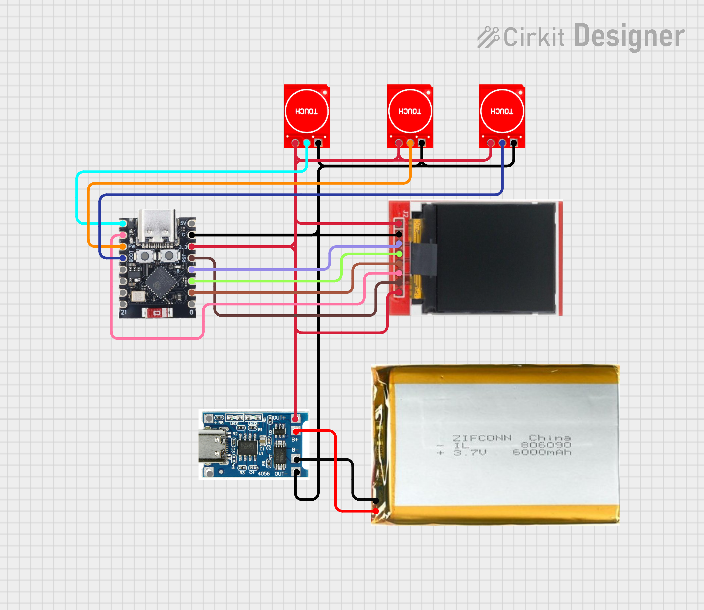

# Tauon Player
A compact WiFi-based remote controller for Tauon Music Player built using an ESP32-C3, capacitive touch sensors, and a TFT display. It allows real-time control of music playback with a simple touch interface while displaying live track information directly on the device. This project was made to create a clean, minimal, and responsive physical music controller instead of relying on keyboard or software controls.

## How to Use :
- Power the ESP32 device and connect it to WiFi.
- Make sure Tauon Music Player is running on the same network.
- Use the touch buttons to control playback.
- View live song details, progress, and volume on the display.

## Working :
- The device connects to Tauon via its HTTP API.
- It continuously fetches playback data (every ~500 ms) to stay in sync.
- Touch inputs are used to send control commands.
- The display shows:
  - Song title and artist
  - Playback status (Playing/Paused)
  - Progress bar and time
  - Volume level

## Controls :
- Play Button : Toggle Play/Pause
- Volume +
  - Short Press : Increase Volume
  - Long Press : Next Track
- Volume - 
  - Short Press : Decrease Volume
  - Long Press : Previous Track

## Images :

  
  

  
  

  

 
 

## BOM :

| Name | Purpose | Quantity | Total Cost (USD) | Link | Distributor |
|------|--------|----------|------------------|------|------------|
| Battery | For powering the system | 1 | 3.23 | [Link](https://quartzcomponents.com/products/3-7v-30c-1000mah-lithium-polymer-rechargeable-battery-yy802542?variant=44899880272106) | Quartz Components |
| TTP223 Capacitive Touch Sensor | Touch input controls | 3 | 0.32 | [Link](https://quartzcomponents.com/products/red-ttp223-1-channel-capacitive-touch-sensor-module?variant=44667009499370) | Quartz Components |
| TP4056 Charging Module (Type-C) | Battery charging & protection | 1 | 0.17 | [Link](https://quartzcomponents.com/products/tp4056-battery-charging-protection-module-type-c?variant=39545849774264) | Quartz Components |
| 1.44" ST7735 TFT Display | Display output | 1 | 3.47 | [Link](https://www.xcluma.com/1-44-inch-hd-tft-oled-color-high-resolution-display-128x128-ips-screen-st7735) | xcluma |
| ESP32-C3 Super Mini | Main microcontroller | 1 | 3.05 | [Link](https://quartzcomponents.com/products/esp32-c3-super-mini-development-board-with-soldered-headers-hw-466ab) | Quartz Components |
| Taxes | — | — | 1.97 | — | — |
| Shipping | — | — | 1.72 | — | — |
| **Total** |  |  | **13.93 USD** |  |  |

